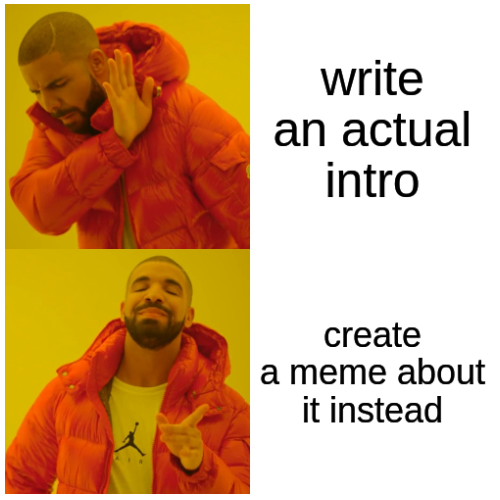
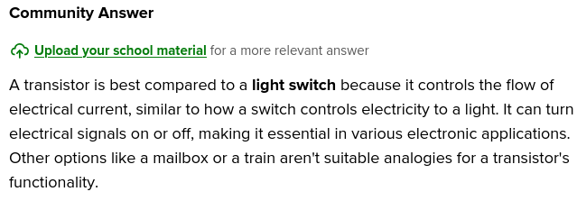

# The Language of the Bits



I'm glad you're here. Let's get straight to business. :D

## Table of Contents
1. [Bitboards Revisited (Again)](#bitboards-revisited-again)
2. [A Preface to Bit Arithmetic](#bit-arithmetic-a-much-needed-introduction)
3. [Closing Thoughts](#departing-bit-arithmetic-next-stop-bit-magic)

## Bitboards Revisited (Again)

```java
long board =  // long is guaranteed to be 64-bits in Java
0b            // tells the compiler this is a binary number
  0 0 0 0 0 0 0
  0 0 0 0 1 1 0
  0 0 1 1 1 1 0
  1 0 1 1 1 1 1
  1 1 1 1 1 1 1
  1 1 1 1 1 1 1
; // 0 = empty, 1 = piece
```

> [!TIP]
> Recall that there is padding around this 6x7 board to make it exactly 64 bits. We'll discuss later how to arrange those extra bits!

You might remember this bitboard from last [section](board-representation.md#bitboards--revisited). It stands to reason that if one bitboard tells us where *pieces* are, we still need a way to know *whose* they are. How would we know? Well — you can't. :)

Books closed. Class over. \
(*\*Patiently waits for you to leave*\*.)

... (*\*Sigh*\*) I see I'm not losing you that easy. Well — we just use two. It's actually pretty tempting to create two bitboards like this:

```java
long board1 = 
0b
  0 0 0 0 0 0 0
  0 0 0 0 1 0 0
  0 0 0 1 0 1 0
  1 0 1 1 0 1 0
  0 0 1 0 1 0 0
  1 1 0 1 0 1 0
; // 0 = empty, 1 = player 1

long board2 = 
0b
  0 0 0 0 0 0 0
  0 0 0 0 0 1 0
  0 0 1 0 1 0 0
  0 0 0 0 1 0 1
  1 1 0 1 0 1 1
  0 0 1 0 1 0 1
; // 0 = empty, 1 = player 2
```

Don't get me wrong, this totally works — and is what I tried to do personally. But there's another way I want to show you.

### A mask — is someone sick??

A **mask** is just a bitboard that marks where something is true — not who or what it is. It's a bit like an outline overlaid on top of another image. We can implement it like so:

```java
long mask =
0b
  0 0 0 0 0 0 0
  0 0 0 0 1 1 0
  0 0 1 1 1 1 0
  1 0 1 1 1 1 1
  1 1 1 1 1 1 1
  1 1 1 1 1 1 1
; // 1 = ANY piece (either player)

long currentPlayer = 
0b
  0 0 0 0 0 0 0
  0 0 0 0 1 0 0
  0 0 0 1 0 1 0
  1 0 1 1 0 1 0
  0 0 1 0 1 0 0
  1 1 0 1 0 1 0
; // 1 = current player's piece
```

*\*'What?? How did this solve anything? What about the other player? I still don't understand what a mask is for!"*\* \
Good questions, my apprentice. Come, we must master the magical language of the bits.

## Bit Arithmetic: A Much Needed Introduction

### Choo-choo! All aboard!!

I need to bridge a *bit* of knowledge here from the last document. You may have wondered how 0's and 1's are stored... exactly. At its most fundamental level, a bit is just the control of current flow. Through what? A __**transistor**__, of course.

You can think of a transistor as a **train station**. Instead of the Penn Station or the Gare du Nord, we have the (*\*deep breath*\*) Complementary Metal-Oxide Semiconductor (**CMOS**) inverter. The **train** itself is the current (flow of electrons) traveling through the metal (the **tracks**) that carry the voltage signals (the **directions**). 

When voltage arrives at a station, it activates the transistor's gate terminal (the **switch/lever**), closing one path and opening the other (**NMOS + PMOS**). The output wire (the **departing track**) is connected to either the High Supply or to Ground (**destinations**), sending the new determined voltage to the next station.

 \
*\*"__NOOO__ Timmy, transistors are *not* like trains. I never want to hear such an absurd idea from you *ever* again. It's a light switch, damn you! A light switch! Into the wormhole you go!!"*\*

Slap a hundred billion of those train stations on a wafer chip and you've built yourself the brain of a computer. \
But what has this to do with bits or bitboards? Everything, Dr. Watson, everything!

### From station gates to logic gates

#### The "NOT" gate

The simplest station you have is the **Inverter**. If a high voltage (a `1`) train arrives, the transistor-switches automatically redirect the output to a low voltage (a `0`) track. It simply reverses the signal.

This logical operation is called a **NOT**.
- Input 1 (High) → Output 0 (Low)
- Input 0 (Low) → Output 1 (High)

#### The "AND" gate

The next station chains two switches, A and B, placed one after the other. For the train (current) to get to the High destination, the path (track) through **switch A must be open** (i.e., conductive) **AND** the path through **switch B must be open**. If either path is blocked (closed), the current is likewise blocked.

This logical operation is called an **AND**.

| Gate A | Gate B | Output |
| ------ | ------ | ------ |
| High   | Low    | Low    |
| Low    | High   | Low    |
| Low    | Low    | Low    |
| High   | High   | High   |

#### The "OR" gate

This station is set up identically to the **AND** gate but with slightly different rules. For a train (current) passing through an **OR** gate, **either Switch A is closed OR switch B is closed (including both!)**. If at least one switch is closed, the current is allowed to pass through.

| Gate A | Gate B | Output |
| ------ | ------ | ------ |
| High   | Low    | High   |
| Low    | High   | High   |
| Low    | Low    | Low    |
| High   | High   | High   |

### Summary

Transistor gates are baked into the DNA of computer programming itself. We already have familiar ways of expressing them. Consider:

```java
boolean a = true, b = false;

a && b  // a AND b  → false
a || b  // a OR b   → true
!a      // NOT a    → false
!b      // NOT b    → true
```

I hear you, I hear you! *\*"What was the point of all this? Transistors? Train Stations?? __What about bitboards__?"*\* \
Look, my dearest friend — look! Have we not accomplished something marvelous together? Have we not brought the realm of the abstract to its very knees? The command of the language of machines lay in our very hands!

## Departing Bit Arithmetic. Next Stop: Bit Magic

Bits are but an alphabet of NOT's, AND's, and OR's. Nevertheless, the complexity of the language's words form some of the most genuinely breath-taking algorithms I've ever had to the opportunity to witness. The ingenuity of early computer scientists is a treat to discover — and I want you to see it. Let's make good on the promise to find a winning bitboard formula in just four moves.

Come, [follow me](bit-magic.md).